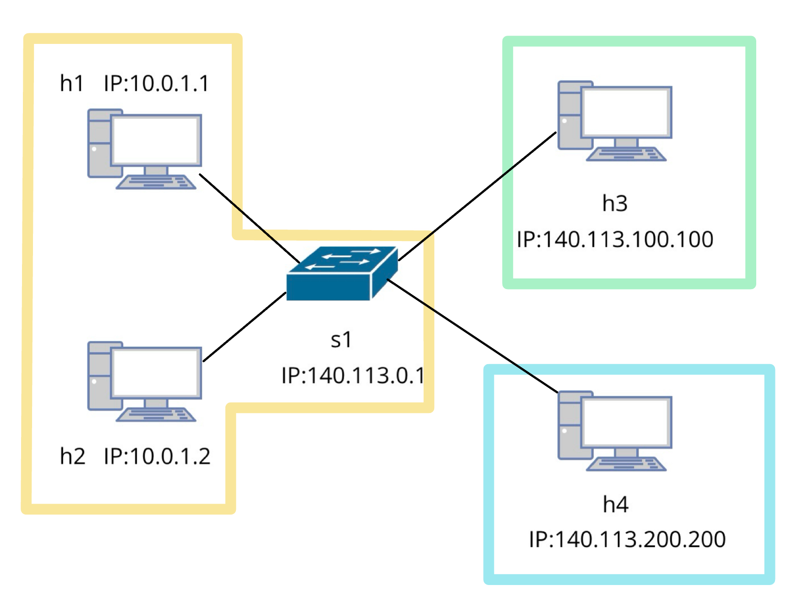

# NSC Final Lab - NAT Implementation using P4 language with bmv2 switch
## Introduction:
This project is a simple implementation of Layer 4 port based NAT (Network Address Translation) using P4 language with bmv2 switch. The environment will simulate a scheme with a internal network and outer network, then any packet with L4 TCP/UDP header will be translated to the outer/internal network with a public IP address using the src/dst transport layer port.
## Environment:
- Ubuntu: 20.04
- Mininet: 2.3.1b4
- bmv2: Connot find the version.
- p4c: 1.2.4.2
## Installaion Guide:
Using the repo P4-guide to install the environment, the installation script I used is install-p4dev-v5.sh, but it must running in Ubuntu 20.04, you can find it in the bin folder. Using other version installation script or ubuntu may cause a longer installing time or dependency problem. After the installation, all the environment including mininet, bmv2, p4c, and other necessary tools will be installed in the system.
### Repo link:
https://github.com/jafingerhut/p4-guide.git
### Installation command:
```
$ git clone https://github.com/jafingerhut/p4-guide.git
$ cd bin
$ bash install-p4dev-v5.sh
```
## Run Code
Using command "make" to run the code, it will compile the p4 code and start the mininet environment. Any compile error will be shown in the terminal, and the mininet environment will be started if the code is compiled successfully.
```
$ make
```
## Clean Running log
This command will delete all the logs during the running time, so if you want to debug using the log, please do not use this command, or using this after you finish debugging.
```
$ clean
```

## Network Topology
The topology is a network with 4 hosts and 1 switch, I simply divide the network into three parts, internal network h1 and h2, two outer network h3 and h4, three networks are connected by the switch s1. The MAC address and IP address are shown in the following table:

### Network 1:
- h1 and h2, with MAC address prefix `08:00:00:01:{host_number}` and IP prefix `10.0.1.{host_number}/24`
- Default gateway: `10.0.1.10` at eth0 to switch s1
- Using public IP address: `140.113.0.1`
### Network 2:
- h3 with MAC address `08:00:00:03:03` and IP address `140.113.100.100/24`
- Default gateway: `140.113.100.50` at eth0 to switch s1
### Network 3:
- h4 with MAC address `08:00:00:04:04` and IP address `140.113.200.200/24`
- Default gateway: `140.113.200.50` at eth0 to switch s1

| Host |    MAC Address    |     IP Address    |
|------|-------------------|-------------------|
|  h1  | 00:00:00:00:01:01 |   10.0.1.1/24     |
|  h2  | 00:00:00:00:01:02 |   10.0.1.2/24     |
|  h3  | 00:00:00:00:03:03 | 140.113.100.100/24|
|  h4  | 00:00:00:00:04:04 | 140.113.200.200/24|
## Command and Program test:
Once you finish set up the environment, you can use the following command to test the network:
```
mininet> pingall
```
This command will help you to inspect the network connection of the NATIVE IP (not translated after NAT), if the network is connected successfully, you can see the following result:
```
*** Ping: testing ping reachability
h1 -> h2 h3 h4 
h2 -> h1 h3 h4 
h3 -> h1 h2 h4 
h4 -> h1 h2 h3 
*** Results: 0% dropped (12/12 received)
```
If the result is same as above, you can use the following command to test the NAT function, The test program can be classified into these parts:

1. Forwarding between the internal network.
    
    This part will test the forwarding function between the internal network, two hosts in the internal network will run an UDP program to send and receive messages.

    Test conetent:
    - udp.py 'host number's: This program will set up a sender thread and a receiver thread, both bind at port 8080, host number helps you automatically set the IP address of the host.

    Test flow:
    ```
    mininet> xterm h1 h2
    ```
    At terminal h1:
    ```
    h1> python3 udp.py 1
    Enter destination IP address: 10.0.1.2
    Enter destination port: 8080
    Enter message: Hello from  h1
    ```
    At terminal h2:
    ```
    h2> python3 udp.py 2
    ```

    After the test, you will see the message "Hello from h1" is received by h2, which means the forwarding function between the internal network is working.

2. Forwarding between the external network.

    This part will test the forwarding function between the outer network, two hosts in the outer network will run an UDP program to send and receive messages.

    Test content:
    - udp.py 'host number's: This program will set up a sender thread and a receiver thread, both bind at port 8080, host number helps you automatically set the IP address of the host.

    Test flow:
    ```
    mininet> xterm h3 h4
    ```
    At terminal h3:
    ```
    h3> python3 udp.py 3
    Enter destination IP address: 140.113.200.200
    Enter destination port: 8080
    Enter message: Hello from  h3
    ```
    At terminal h4:
    ```
    h4> python3 udp.py 4
    ```

    After the test, you will see the message "Hello from h3" is received by h4, which means the forwarding function between the outer network is working.
3. Test the UDP connection from an internal network host to an outer network host.

    This part is going to test the basic NAT function of the switch, the UDP packet from the internal network will be translated to the outer network with the public IP address.

    Test content:
    - udp.py 'host number's: This program will set up a sender thread and a receiver thread, both bind at port 8080, host number helps you automatically set the IP address of the host.

    Test flow:
    ```
    mininet> xterm h2 h3
    ```
    At terminal h3:<br>
    ```
    h3> python3 udp.py 3
    ```
    At terminal h2:
    ```
    h2> python3 udp.py 2
    Enter destination IP address: 140.113.100.100
    Enter destination port: 8080
    Enter message: Hello from  h2
    ```

    In this part, the result will be totally different from the previous two parts, in terminal h3, you will see the message "Hello from h2" is received, and the source IP address is `140.113.0.1`, source port is not `8080`, which means the NAT function is working correctly. 
4. TCP connection from two host in same internal network to the outer network host.

    This part is going to test if two internal network hosts are trying to connect to a same outer network host, the NAT function will translate the source IP address and port to the public IP address and port.

    Test content:
    - tcp_sender.py 'host number's: This program will start a sender thread on port `8888`, host number helps you automatically set the destination IP address and port of the target host.
    - tcp_receiver.py: This program will listen to the port 12345 and receive the message from the sender.

    Test flow:
    ```
    mininet> xterm h1 h2 h3
    ```
    At terminal h3:
    ```
    h3> python3 tcp_receiver.py
    ```
    At terminal h1:
    ```
    h1> python3 tcp_sender.py 1
    ```
    At terminal h2:
    ```
    h2> python3 tcp_sender.py 2
    ```
    After the command is executed, in terminal h3, you will see two host have connected to the server, both source IP address is 140.113.0.1 but with different source port, which means the NAT function is working correctly.

5. Test the running server in the internal network can be accessed by the outer network.

    In the previous part, once we want to start a connection between the internal network and the outer network, we need to set up the connection from the internal network to the outer network first. But in P4 NAT, the connection can be forwarding from the outer network to the internal network directly, any connection want to access the server via specific port, can be forwarded to the specific host in the internal network.

    Test content:
    - server.py: The server program, it will listen to the port 80 to simulate the http web server.
    - client.py: The client program, it will build a connection to the server program.

    Test flow:
    ```
    mininet> xterm h1 h4
    ```
    At terminal h1:
    ```
    h1> python3 server.py
    ```
    At terminal h4:
    ```
    h4> python3 client.py
    ```

    After the command is executed, you can see h4 will periodically receive a message `"Hello from server"` from h1, which means we can bind the specific port to the specific host in the internal network. And thus do not need to set up the connection from the internal network to the outer network first.
