# NSC Final Lab - NAT Implementation using P4 language with bmv2 switch
## Repository link:
All the code and environment setup can be found in the repository : https://github.com/Zhih25/NSC_final

[NSC_final](https://github.com/cchihw/NSC_final)

## Introduction:
This project is a simple implementation of Layer 4 port based NAT (Network Address Translation) using P4 language with bmv2 switch. The environment will simulate a scheme with internal network and outer network, then any packet with L4 TCP/UDP header will be translated to the outer/internal network with a public IP address using the src/dst transport layer port.

## Motivation:
Because of my CS project is related to the P4 language, so actually I have learned P4 for a while. During the time learning P4, I found that  I am interested in the P4 language, also I found that I was not much familiar with the concept of NAT, so I choose to implement the NAT in P4 language to practice the basic concept of P4 language.
## Main Concept:
Any packet from the ineternal network to the outer network will be assign an unique port number using the combination of source IP and source port to avoid the conflict. The packet will be translated to the public IP address, and the reply packet from the outer network will use that unique port number to trace back the corresponding internal IP and port number.

## Design Concept:
1. Using {IP, port} pair in register to assign a unique port number for the packet from the internal network to the outer network.
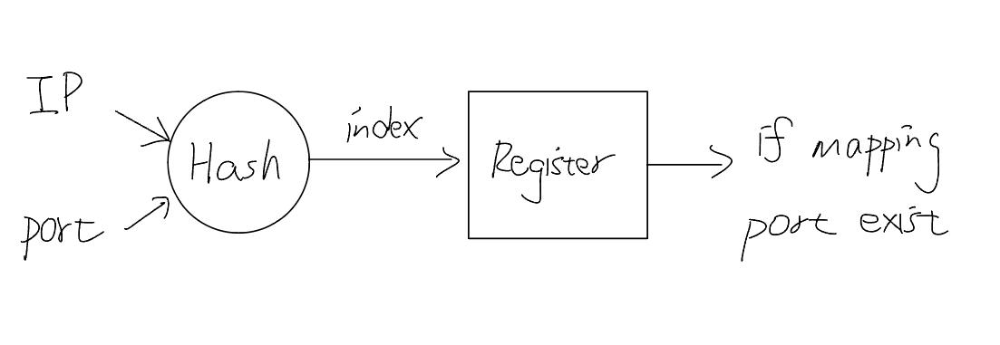
2. The external port number is using ring buffer to avoid the conflict.
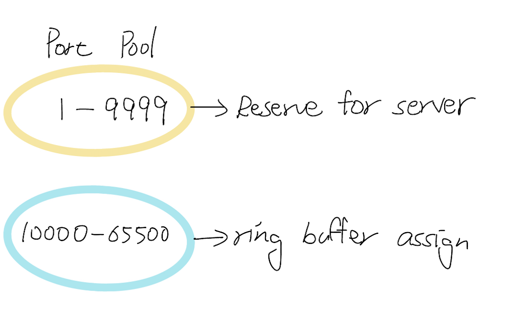
3. The register will store the mapping between the unique port number and the source IP address and port number.
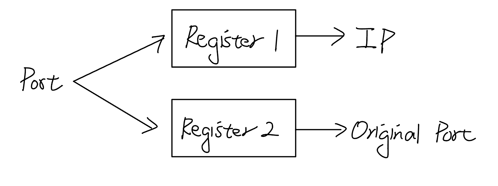

## Expected Result:
1. Switch forward the packet between the internal network and the outer network correctly.
2. Switch is able to handle TCP and UDP packet.
3. Switch is able to assign a unique port number used in public IP address for a internal packet and change the source IP address to the public IP address.
4. Switch is able to translate the unique port number back to the corresponding internal IP and port number.
5. Switch can be statically set up to support the sever running in the internal network.

## Network Topology
The topology is a network with 4 hosts and 1 switch, I simply divide the network into three parts, internal network h1 and h2, two outer network h3 and h4, three networks are connected by the switch s1. The MAC address and IP address are shown in the following table:

### Network 1:
- h1 and h2, with MAC address prefix `08:00:00:01:{host_number}` and IP prefix `10.0.1.{host_number}/24`
- Default gateway: `10.0.1.10` at eth0 to switch s1
- Using public IP address: `140.113.0.1`
### Network 2:
- h3 with MAC address `08:00:00:03:03` and IP address `140.113.100.100/24`
- Default gateway: `140.113.100.50` at eth0 to switch s1
### Network 3:
- h4 with MAC address `08:00:00:04:04` and IP address `140.113.200.200/24`
- Default gateway: `140.113.200.50` at eth0 to switch s1

### Network Configuration:

| Host |    MAC Address    |     IP Address    |
|------|-------------------|-------------------|
|  h1  | 00:00:00:00:01:01 |   10.0.1.1/24     |
|  h2  | 00:00:00:00:01:02 |   10.0.1.2/24     |
|  h3  | 00:00:00:00:03:03 | 140.113.100.100/24|
|  h4  | 00:00:00:00:04:04 | 140.113.200.200/24|

### Routing Table:

Routing table is set in file `s1-runtime.json`, the table is shown below:

| Destination IP   | Egress Port | MAC Address          |
|------------------|-------------|----------------------|
|10.0.1.1/32       |1            |08:00:00:00:01:01     |
|10.0.1.2/32       |2            |08:00:00:00:01:02     |
|140.113.100.100/32|3          |08:00:00:00:02:03     |
|140.113.200.200/32|4          |08:00:00:00:03:04     |


## Experiment Result:

I designed five experiments to test whether the switch performing NAT can achieve the expected results. The results are shown below, and the testing procedures are detailed in the `README.md` file.
1. **Forwarding between the internal network.**

    This part is aimed to test the connection between the internal network, the packet should be forwarded correctly between h1 and h2.

    Result: 
    | h1's terminal    | h2's terminal    |
    |------------------|------------------|
    | 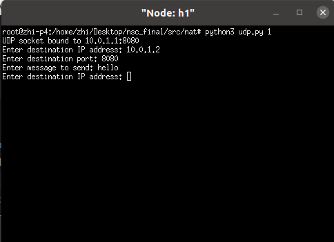 | 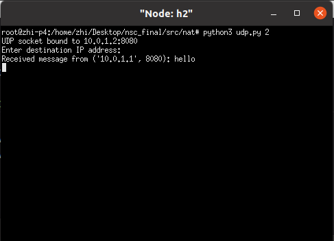 |

    Wireshark in h1 and h2:

    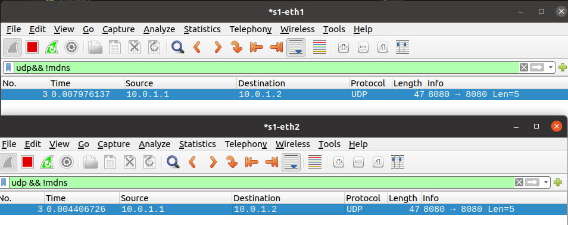

    In the screenshot above, we can see that the packet is forwarded correctly from h1 to h2.

2. **Forwarding between the external network.**

    This part is aimed to test the connection between the external network, the packet should be forwarded correctly between h3 and h4, both IP and port are not rewrite by the switch.

    Result:
    | h3's terminal    | h4's terminal    |
    |------------------|------------------|
    | 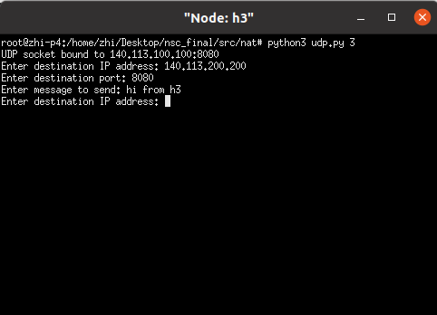 | 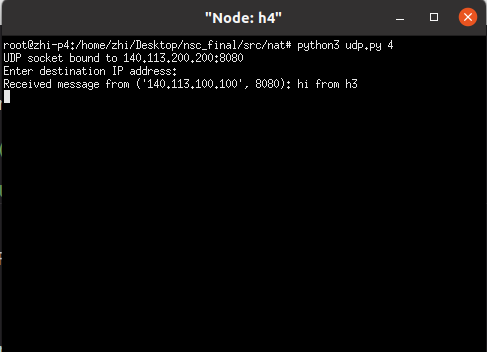 |

    Wireshark in h3 and h4:

    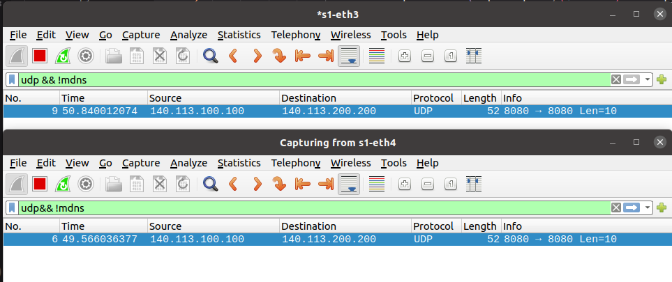

    In the screenshot above, we can see that the packet is forwarded correctly from h3 to h4, both IP and port are not rewrite by the switch.

3. **Test the UDP connection from an internal network host to an outer network host.**

    This part is going to test the UDP connection from h2 to h3. Because the packet is sent from the internal network to the outer network, NAT should be applied, the source IP address and port number of the packet should be translated to the public IP address `140.113.0.1` and a unique port number assigned by the switch.

    Result:
    | h2's terminal    | h3's terminal    |
    |------------------|------------------|
    | 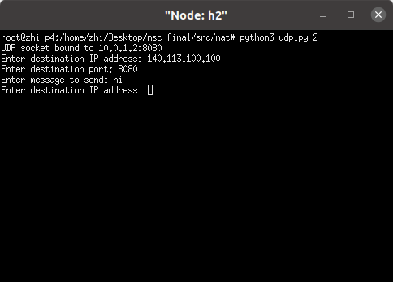 | 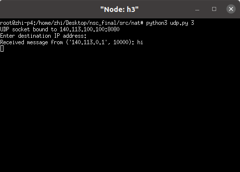 |

    Wireshark in h2 and h3:

    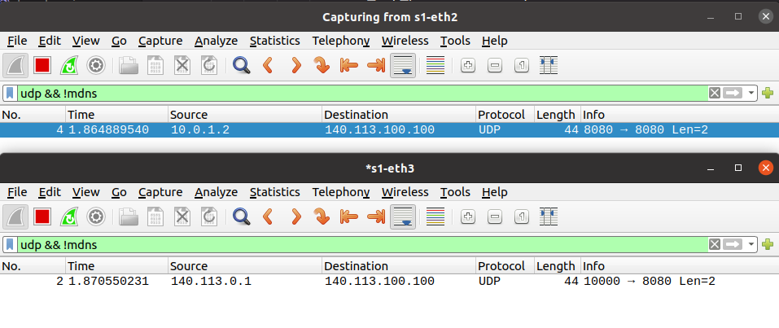

    From the screenshot above, we can see that the IP and source port shown in h2 is `10.0.1.2` and `8080`,but when the packet is received by h3 is the public IP address `140.113.0.1` and the unique port number `10000` after the NAT translation. Thus the packet is forwarded correctly from h2 to h3.

4. **TCP connection from two host in same internal network to the outer network host.**

    This part is going to test if two internal network hosts are trying to connect to a same outer network host, the NAT function will translate the source IP address and port to the public IP address and port.
    
    In the test, both h1 and h2 are binding to the same port `8888` and try to connect to h3, the packet should be translated to the public IP address `140.113.0.1` and the port number should be unique.

    Result:
    | h1's terminal    | h2's terminal    | h3's terminal    |
    |------------------|------------------|------------------|
    | 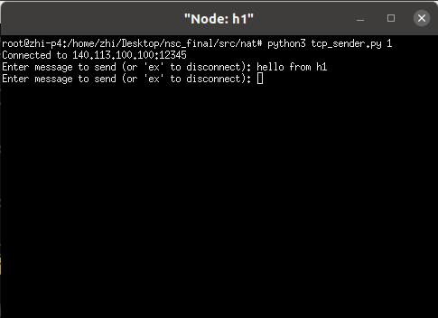 | 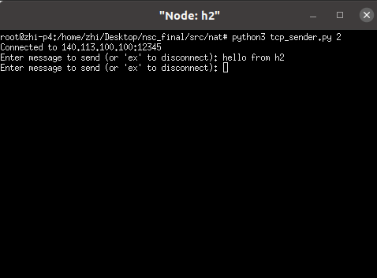 | 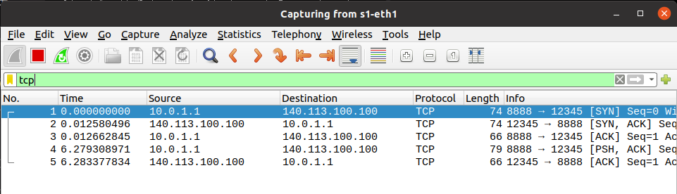 |

    Wireshark in h1, h2 and h3:
    h1's wireshark:
    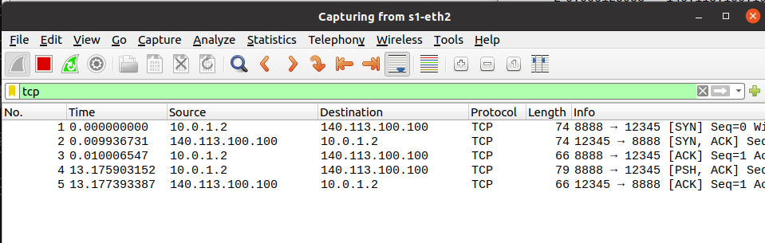
    h2's wireshark:
    
    h3's wireshark:
    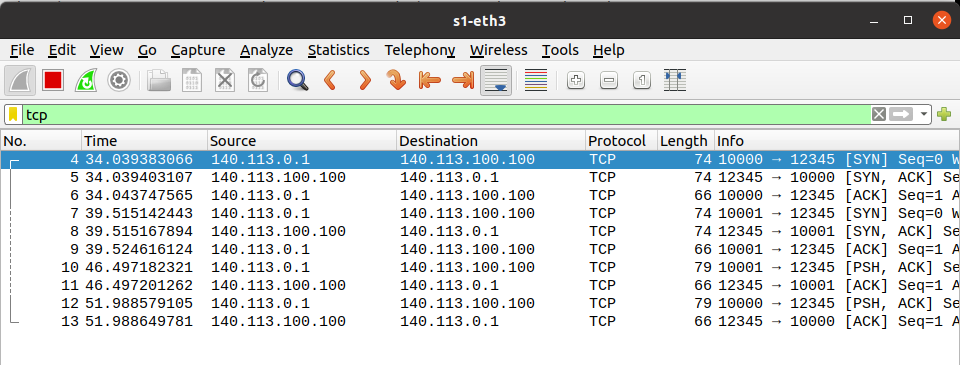

    From the screenshot above, we can see that TCP connection is working correctly between h1 and h3, and h2 and h3. From the wireshark in h1 and h2, we can see that the source IP address and port number are both their own IP address and port number in the internal network, but when the packet is received by h3, the source IP address is the public IP address `140.113.0.1` and the port number is unique. So the NAT function is working correctly.


5. **Test the running server in the internal network can be accessed by the outer network.**

    In the previous part, once we want to start a connection between the internal network and the outer network, we need to set up the connection from the internal network to the outer network first. But in P4 NAT, the connection can be forwarding from the outer network to the internal network directly, any connection want to access the server via specific port, can be forwarded to the specific host in the internal network.

    In the test, the server is running in h1, and the server is listening to the port `80` to simulate a web server, the client is running in h4 and try to access the server in h1. h4 is expected to receive the message from the server in h1.

    Result:
    | h1's terminal    | h4's terminal    |
    |------------------|------------------|
    | 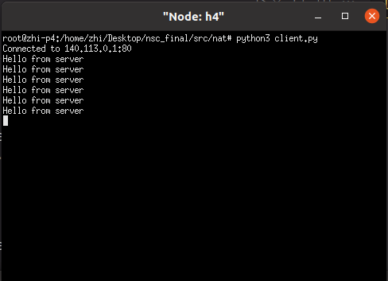 | 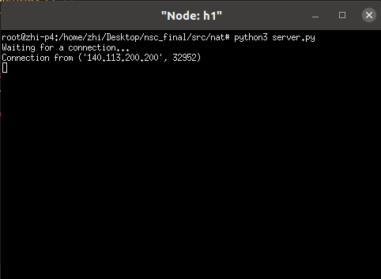 |

    Wireshark in h1:<br>
    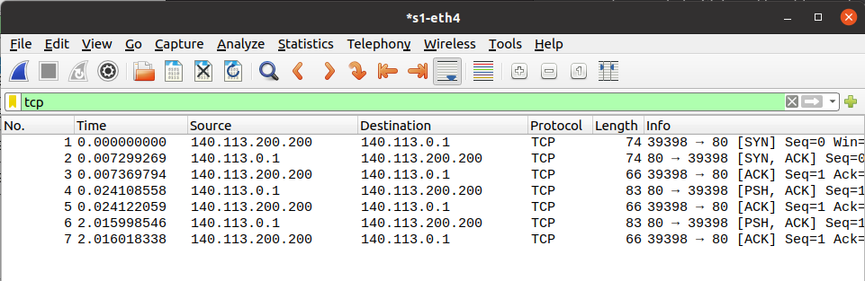


## Code Implementation:
### Header
```
    header ethernet_t {
        macAddr_t dstAddr;
        macAddr_t srcAddr;
        bit<16>   etherType;
    }

    header ipv4_t {
        bit<4>    version;
        bit<4>    ihl;
        bit<8>    diffserv;
        bit<16>   totalLen;
        bit<16>   identification;
        bit<3>    flags;
        bit<13>   fragOffset;
        bit<8>    ttl;
        bit<8>    protocol;
        bit<16>   hdrChecksum;
        ip4Addr_t srcAddr;
        ip4Addr_t dstAddr;
    }

    header udp_t{
        bit<16> srcPort;
        bit<16> dstPort;
        bit<16> length;
        bit<16> checksum;

    }
    header tcp_t{
        bit<16> srcPort;
        bit<16> dstPort;
        bit<32> seq_num;
        bit<32> ack_num;
        bit<4>  data_offset;
        bit<3>  reserved;
        bit<9>  ctl_flag;
        bit<16> window_size;
        bit<16> checksum;
        bit<16> urgent_num;
    }
    header_union l4_t{
        udp_t udp;
        tcp_t tcp;
    }
    struct metadata {
        bit<16> tcp_length;
        bit<16> tot_length;
        bit<16> udp_length;
    }
    struct headers {
        ethernet_t   ethernet;
        ipv4_t       ipv4;
        l4_t         l4;
    }
```

Header struct is set up as the above code, because NAT is modifying the IP address and port number, so the header block have to include the transport layer header. In the transport layer header, my switch should be able to handle both TCP and UDP packet, so I use the header_union to include both TCP and UDP header, and encapsulate them in the l4_t header.
I also set up three metadata variables to store the length of the TCP, UDP, and total length of the packet, these variables will be used in checksum update, and the variables will be initialized in the parser.
### Parser
```
parser MyParser(packet_in packet,
                out headers hdr,
                inout metadata meta,
                inout standard_metadata_t standard_metadata) {

    state start {
        transition parse_ethernet;
    }

    state parse_ethernet {
        packet.extract(hdr.ethernet);
        transition select(hdr.ethernet.etherType) {
            TYPE_IPV4: parse_ipv4;
            default: accept;
        }
    }
     state parse_ipv4{
        packet.extract(hdr.ipv4);
        transition select(hdr.ipv4.protocol) {
            TYPE_UDP  : parse_udp;
            TYPE_TCP  : parse_tcp;
            default   : accept;
        }
    }
    state parse_udp{
        packet.extract(hdr.l4.udp);
        meta.udp_length = hdr.ipv4.totalLen-20;
        transition accept;
    }
    state parse_tcp{
        packet.extract(hdr.l4.tcp);
        meta.tcp_length = (bit<16>)hdr.l4.tcp.data_offset * 4;
        meta.tot_length = hdr.ipv4.totalLen-20;
        transition accept;
    }

}
```
The parser is a FSM that will parse the packet from the Ethernet header to the transport layer header. The parser will first parse the Ethernet header, then parse the IPv4 header. After parsing the IPv4 header, the parser will select the protocol type, if the protocol is UDP, the parser will parse the UDP header, and store the length of the UDP packet in the metadata. Or the TCP header will be parsed, and the length of the TCP packet and the total length of the packet will be stored in the metadata.

Generally, TCP header includes the option field, but for NAT implementation, it is not necessary to parse the option field. Therefore,I parse TCP field as a fix length field, and threat the option field as payload in the TCP packet.
### Ingress

Ingress part is the main part of the switch, which NAT is implemented in this part.  At first, I set up 4 registers to store the nessary information for the NAT translation. 


- `port_counter` is used to assign a unique port number for the packet from the internal network to the outer network.
- `out_in_IP` is used to store the mapping between the unique port number and the source IP address.
- `out_in_port` is used to store the mapping between the unique port number and the source port number. 
- `ip_port_to_out` is used to store the mapping between the source IP address and the source port number to the unique port number.

For the IP forward part, I set up 3 actions:
- `drop` is used to drop the packet, which set the flag drop in the standard_metadata.
- `multicast` is used to set the multicast group in the standard_metadata, this action is for use in ARP.
- `ipv4_forward` is used to forward the packet to the specific port, which set the destination MAC address and the egress port in the standard_metadata, the table has been set up in `s1-runtime.json`.
These three actions are used in the `ipv4_lookup` table, which use longest prefix match to forward the packet to the specific port.


Besides the actions for ipv4 forwarding, I define one more action for modifying the register storing the NAT translation information.

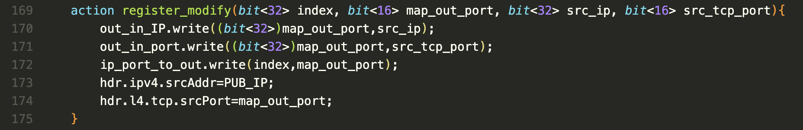

This action is used to update the register `ip_port_to_out`, `out_in_IP`, and `out_in_port` after the NAT translation. The action will be used in the apply part.

In the apply part, I first using bit operation to check if the IP address is in the internal network.

If the packet's destination IP address is in the internal network, the packet will be forwarded directly to the specific port using the `ipv4_lookup` table.

- This is a simple way to check if the IP address is in the internal network, in a multi-subnet network senario, I think this idea is still useful, but the implementation will be more complex.

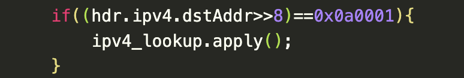

If the destination IP address is not in the internal network, the packet will be checked if it is a TCP or UDP packet, and set up some variables to store the source and destination IP address and port number for the later use in NAT translation.

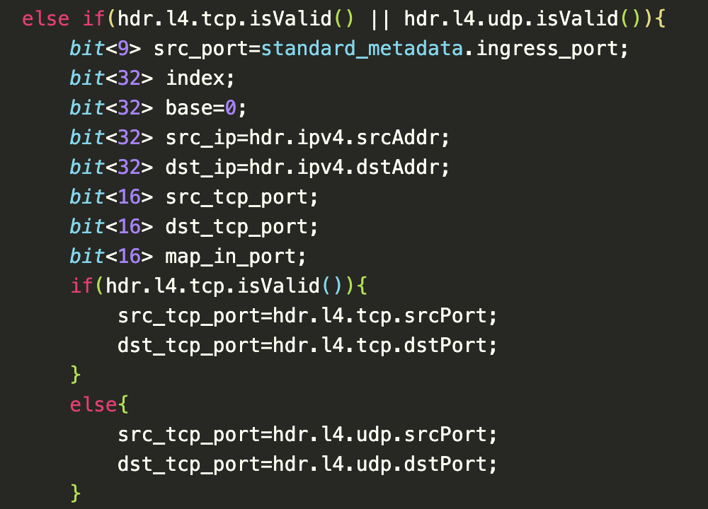

Later, check if this packet is sent or received from the specific port, if so, the source IP address will be translated to the public IP address, and the port number will not be changed. So the port forwarding part is implemented.
- I think this part can be written in a more concise way, but now I just want to demonstrate this function in a simple way. Sorry~

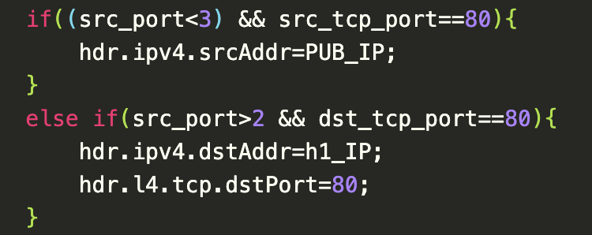

In the next, the case if the packet is ingress from the internal network and not sent from the specific port. The switch will first put source IP address and port number together into a hash value, then check if the hash value is in the register `ip_port_to_out`. If the corresponding port number is `0`, which means this is a new `{IP, port}` pair, the switch will assign a unique port number to the packet, and store the mapping IP address and source port number to register `out_in_IP` and `out_in_port`, and store the mapping between the hash value and the unique port number to the register `ip_port_to_out`. Then the source IP address will be translated to the public IP address, and the source port number will be translated to the unique port number. If the corresponding port number is not `0`, which means this `{IP,port}` pair has been assigned a unique port number, the switch will translate the source IP address to the public IP address, and use this unique port number as the source port number. By the way, if the port number is larger than `65500`, the port number will be reset to `10000`. After the unique port number is assigned, the action 'register_modify' will be applied to update the register.

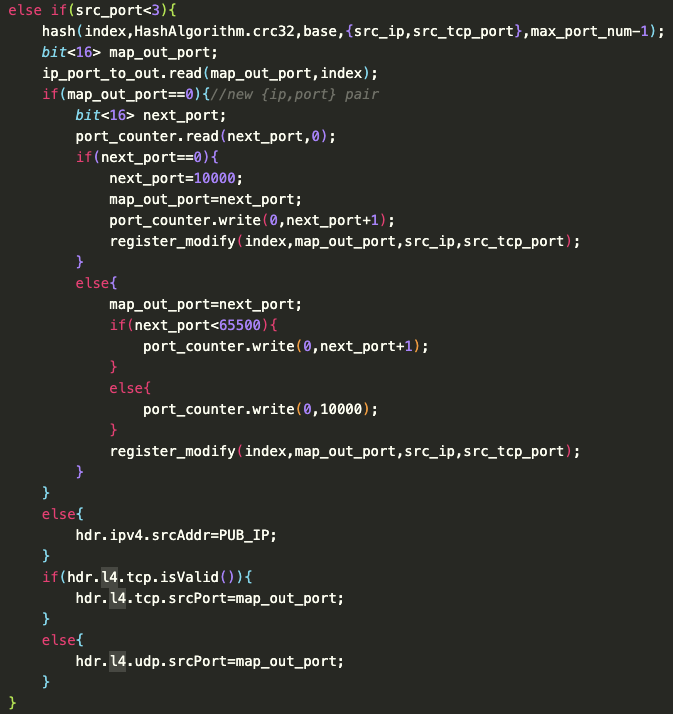

The last part is the packet is received from the outer network, the switch will check if the destination IP address is the public IP address, if so, the NAT translation will be applied, the switch will use the unique port number to find the corresponding source IP address and port number, and translate the destination port number to the source port number.

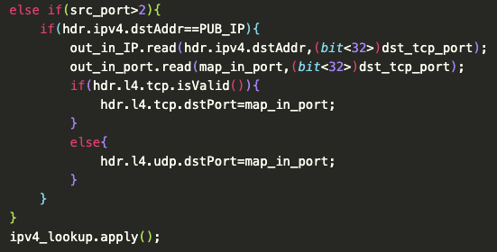

### Checksum update
Checksum update is used after the NAT translation, because the IP address and port number are changed, the checksum in the packet should be updated. 
In this part, three cases of checksum are needed to be checked and updated:
1. **IPv4 checksum**

    IPv4 checksum is calculated by the header of the IPv4, so just simply put the IPv4 header into the checksum update function.

    

2. **UDP checksum**

    UDP checksum is more complex than IPv4 checksum, because the UDP checksum is calculated by the pseudo header, UDP header, and the payload. The pseudo header is the source IP address, destination IP address, protocol type, and the length of the UDP packet. All of then should align in 16 bits, so first in the pseudo header part, 8-bit zero should be combined with the protocol type to align the 16 bits. Then using the function `update_checksum_with_payload` to update the checksum with the payload we do not parse.

    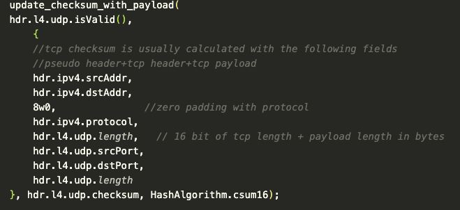

3. **TCP checksum**

    TCP checksum is the most difficult part in checksum updating, like UDP checksum, TCP checksum is calculated by the pseudo header, TCP header, and the payload. The pseudo header is the same as the UDP checksum, just pay attention that the length here is the length of the total TCP header with payload. However, in checksum_update part, any variables cannot be calclated in this part, so I use the metadata calculated in the parser part to update the checksum in the ingress part. Once the metadata is make sure to be correct, the remaining part is the same as the UDP checksum update.

    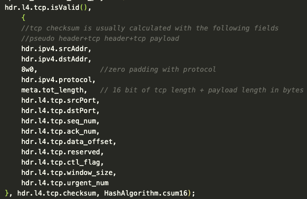

## Conclusion:

In this lab, I learned the basic concept of NAT and how to implement NAT in P4 language. I also learned a lot in mininet building and socket programming, without the help of the mininet and socket programming, I cannot easily set up a network environment and even test the switch. Although the NAT implementation is simple, I think it is still a good practice to understand the basic concept in both NAT and P4 application. Hope I can have more opportunities to research P4 language in the future.

## Reference:
P4 language specification:<br>
https://p4.org/p4-spec/docs/P4-16-v1.0.0-spec.html

P4 spec and tutorial:<br>
https://github.com/p4lang/p4-spec

NAT concept:<br>
https://www.cnblogs.com/wbxjiayou/p/5150753.html

https://en.wikipedia.org/wiki/Network_address_translation

TCP checksum:<br>
https://blog.csdn.net/gufuguang/article/details/121229086

UDP checksum:<br>
https://www.ptt.cc/bbs/NTUE-CS100/M.1262621627.A.945.html
